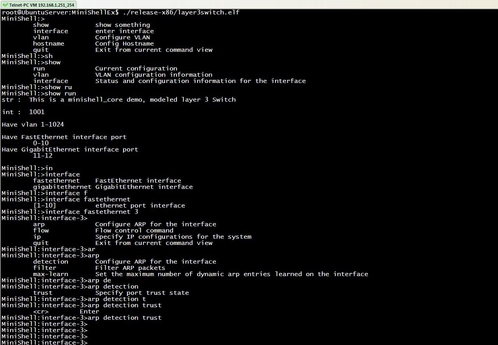

# MiniShell-Ex

该工程用于命令行控制台层次化命令逻辑，如果你用过Cisco、华为、H3C等带网管的网络设备应该能理解。该工程主要用于以Linux为平台的嵌入式设备，提供一种以命令行控制程序运行的方法。通常用于设备远程操控。


## Function/功能（目前拥有）

* 命令关系的层次管理
* 按下 "?键" 自动提示当前可用的命令
* 按下"tab键" 自动补全或提示
* 命令半模糊匹配（允许输入命令的前部分，只要前部分不予其他命令冲突则匹配）



**命令提示**

```
MiniShell:>                                <---- press key "?"
        show            show something
        interface       enter interface
        vlan            Configure VLAN
        hostname        Config Hostname
        quit            Exit from current command view

```

**当命令提示前缀不同时，通常暗示（非必须）命令提示也有改变**

```
MiniShell:interface-1>                      <---- press key "?"
        arp             Configure ARP for the interface 
        flow            Flow control command
        ip              Specify IP configurations for the system
        quit            Exit from current command view
```

**自动补全命令**

```
MiniShell:>interface                      <---- press key "tab"      
        fastethernet    FastEthernet interface
        gigabitethernet GigabitEthernet interface
MiniShell:>interface f
MiniShell:>interface fastethernet 
        [1-10]          ethernet port interface
MiniShell:>interface fastethernet 1
        <cr>        Enter 
MiniShell:>interface fastethernet 1
MiniShell:interface-1>
```

**半模糊匹配**

```
MiniShell:>inte f 1
MiniShell:interface-1>
```

##Depend/依赖

**libminishell-ex.so**  

* libreadline.so 
* libhistory.so
* libtermcap.so

**msbuild** 

* libxml2.so


## Install/安装
本工程里共有4个工程  

* pi1  
生成libminishell-ex.so

* pi2  
生成例程layer3switch

* pi3  
生成msbuild工具

* pi4
生成testbuild

---
* make allp  
编译所有工程[allp.txt](./doc/allp.txt)

* make alldistclean  
清除所有工程输出文件，包括目录

* make allclean   
清除所有工程输出文件

**注意**  
如果 **make allp** 编译报错首先检查依赖的libxxx.so是否存在，再检查编译链是否正确，简单的修改链如下：

```
make CROSS_COMPILE=/xxx/arm-linux- LIB_DIR=-L/xxx/lib  
```

**直接修改**

你也可以根据本机环境来配置编译脚本 **script/common.mk**

* 首先在SUPPORT_TARGET里添加新的平台

```
SUPPORT_TARGET=x86 arm920t armv7 win32 yours
```

* 添加工具链

```
ifeq ("$(ARCH)", "yours")
	CROSS_COMPILE	=/xxx/tool-prefix-
endif
```

* 修改查找目录INCLUDE_DIR,LFLAGS,LIB_DIR,CFLAGS

```
ifeq ("$(ARCH)", "yours")
	INCLUDE_DIR	+= -I/yours/include
	LFLAGS		+= -Wl,-rpath=./:./lib-yours/
	LIB_DIR 	+= -L/yours/lib -L./lib-$(ARCH)
	CFLAGS		+= -DTARGET_yours
endif
```


## Output/编译文件

编译后输出文件在文件夹release-x86、lib-x86（具体与平台有关）。  

* minishell-ex.so  
是最终用于其他项目的文件  

* msbuild  
是用于简化minishell的struct cmd_prompt结构体逻辑层次关系的工具，该工具将一个描* 述struct cmd_prompt逻辑的xml文件读入，再将其生成c文件

* msedit   
还在开发中


##Example/例程

* layer3switch  
模仿H3C交换机的输入界面制作的例程

* testbuild  
它由两个文件编译example/test_auto.c、example/cmd_output.c，其中cmd_output.c是由msbuild自动生成而来的，该工程用于测试msbuild的执行效果，并且让开发人员对本工程xml格式有一定的认识。

##Principle/原理

内部数据结构分析与原理 **(编写中...)**

## TODO/待做

* 目前仅提供msbuild文件，如希望使用该工具需要对xml关系有比较清晰的理解

* 制作msedit工具，该工具采用ncurses界面，简化与可视化xml文件生成，并保证xml文件内容逻辑正确，生成的xml文件工msbuild解析。

##Download/下载

git clone https://github.com/MenglongWu/MiniShellEx.git

##Contact/联系

**Author:** MenglongWoo  
**E-mail:** MenglongWoo@aliyun.com


